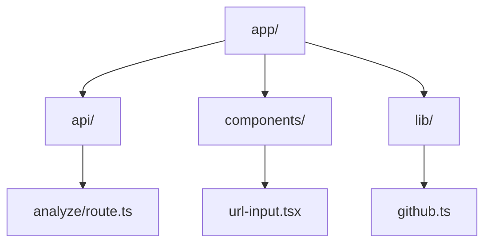

# CLAUDE.md — reponboard-ai

## Project Overview

An AI-powered agent that analyzes any public GitHub repository and generates comprehensive onboarding documentation. Users paste a GitHub URL and receive an architecture breakdown, "start here" recommendations, and can ask follow-up questions about the codebase.

**Tagline:** "Reponboard any codebase in 5 minutes"

## Architecture

### Monorepo Structure

```
reponboard-ai/
├── apps/
│   └── web/                 # Next.js 15 App Router application
│       ├── app/
│       │   ├── page.tsx           # Landing page with URL input
│       │   ├── layout.tsx         # Root layout
│       │   ├── globals.css        # Global styles + Tailwind
│       │   ├── api/
│       │   │   └── analyze/
│       │   │       └── route.ts   # Main analysis API endpoint
│       │   └── analysis/
│       │       └── [id]/
│       │           └── page.tsx   # Analysis results page
│       ├── components/
│       │   ├── url-input.tsx      # GitHub URL input component
│       │   ├── analysis-view.tsx  # Results display
│       │   ├── mermaid-diagram.tsx # Mermaid renderer
│       │   └── qa-chat.tsx        # Q&A interface
│       └── lib/
│           ├── api.ts             # API client
│           └── utils.ts           # Utilities
├── packages/
│   └── agent-core/          # Reusable agent logic (TypeScript)
│       └── src/
│           ├── index.ts           # Main exports
│           ├── types.ts           # TypeScript types
│           ├── github.ts          # GitHub API client
│           ├── discovery.ts       # Phase 1: Repo discovery
│           ├── analysis.ts        # Phase 2: Deep analysis
│           ├── guide.ts           # Phase 3: Guide generation
│           └── qa.ts              # Phase 4: Q&A handler
├── docs/
│   ├── ARCHITECTURE.md
│   └── CONTRIBUTING.md
├── examples/                # Sample analysis outputs
├── package.json             # Root package.json
├── pnpm-workspace.yaml      # pnpm workspace config
├── turbo.json               # Turborepo config (optional)
└── CLAUDE.md                # This file
```

### Agent Phases

**Phase 1: Discovery**
- Parse GitHub URL → extract owner/repo
- Fetch repo metadata (description, stars, language, topics)
- Get full tree structure (recursive)
- Detect stack from config files (package.json, requirements.txt, etc.)
- Identify entry points and key files

**Phase 2: Deep Analysis**
- Fetch content of key files
- Map internal dependencies
- Detect architectural patterns (MVC, microservices, monorepo, etc.)
- Identify complexity hotspots
- Extract conventions (naming, structure, testing)

**Phase 3: Guide Generation**
- Generate executive summary with Claude
- Create architecture diagram (Mermaid)
- Recommend "start here" files with reasons
- Suggest exploration path with time estimates

**Phase 4: Interactive Q&A**
- User asks questions about the codebase
- Agent fetches relevant files on-demand
- Responds with context-aware answers

## Tech Stack

| Layer | Tech | Notes |
|-------|------|-------|
| Framework | Next.js 15 | App Router, RSC-first |
| Language | TypeScript | Strict mode enabled |
| Styling | Tailwind CSS | Dark theme, dev-friendly |
| AI | Claude API | claude-sonnet-4-20250514 with tool use |
| Diagrams | Mermaid.js | Client-side rendering |
| Deploy | Vercel | Free tier |
| Monorepo | pnpm workspaces | Simple, no turborepo needed initially |

## Development Commands

```bash
# Install dependencies
pnpm install

# Start development server
pnpm dev

# Production build
pnpm build

# Type checking
pnpm typecheck

# Linting
pnpm lint

# Run tests
pnpm test
```

## Environment Variables

```bash
# .env.local
ANTHROPIC_API_KEY=sk-ant-...   # Required - Claude API key
GITHUB_TOKEN=ghp_...           # Optional - increases rate limit from 60 to 5000 req/hr
```

## Code Style Guidelines

### General
- Use `async/await` over `.then()` chains
- Prefer named exports: `export function foo()` not `export default`
- TypeScript strict mode — no `any` types, ever
- Explicit return types on functions

### React/Next.js
- Server Components by default
- Add `'use client'` only when needed (interactivity, hooks)
- Use `next/navigation` for routing, not `next/router`
- Collocate components with their pages when page-specific

### Styling
- Tailwind only — no CSS modules, no styled-components
- Dark theme by default (bg-zinc-950, text-zinc-100)
- Monospace font for code/paths: `font-mono`
- Consistent spacing scale: 4, 8, 12, 16, 24, 32, 48

### Error Handling
- Always use try/catch with typed errors
- Create custom error classes for different failure modes
- Return structured errors from API routes, never throw

## API Design

### POST /api/analyze

Starts analysis of a repository.

**Request:**
```json
{
  "repoUrl": "https://github.com/vercel/next.js"
}
```

**Response (streaming JSON):**
```json
{
  "id": "analysis_abc123",
  "status": "discovering",
  "repoInfo": {
    "owner": "vercel",
    "name": "next.js",
    "description": "The React Framework",
    "stars": 120000
  }
}
```

Status progresses: `discovering` → `analyzing` → `generating` → `complete`

Each status update streams as a new JSON object.

### GET /api/analysis/[id]

Retrieves a completed analysis.

### POST /api/analysis/[id]/qa

Sends a question about the analyzed codebase.

**Request:**
```json
{
  "question": "How does the routing system work?"
}
```

**Response:**
```json
{
  "answer": "The routing system in Next.js...",
  "filesReferenced": ["app/router.ts", "lib/navigation.ts"]
}
```

## Key Implementation Details

### GitHub API Usage

Use tree endpoint for efficiency — don't clone repos:
```typescript
GET /repos/{owner}/{repo}/git/trees/{branch}?recursive=1
```

Rate limits:
- Without token: 60 requests/hour
- With token: 5,000 requests/hour

### Stack Detection Logic

Priority order for detection:
1. `package.json` → Node.js ecosystem
   - Check dependencies for framework (next, react, vue, etc.)
2. `requirements.txt` / `pyproject.toml` → Python
3. `go.mod` → Go
4. `Cargo.toml` → Rust
5. `pom.xml` / `build.gradle` → Java

### Claude Tool Definitions

```typescript
const tools = [
  {
    name: "fetch_file",
    description: "Fetch the content of a specific file from the repository",
    input_schema: {
      type: "object",
      properties: {
        path: { type: "string", description: "File path relative to repo root" }
      },
      required: ["path"]
    }
  },
  {
    name: "search_code", 
    description: "Search for patterns or keywords in the codebase",
    input_schema: {
      type: "object",
      properties: {
        query: { type: "string", description: "Search query" },
        filePattern: { type: "string", description: "Glob pattern to filter files" }
      },
      required: ["query"]
    }
  },
  {
    name: "list_directory",
    description: "List contents of a directory",
    input_schema: {
      type: "object", 
      properties: {
        path: { type: "string", description: "Directory path" }
      },
      required: ["path"]
    }
  }
]
```

### Mermaid Diagram Generation

The agent generates architecture diagrams in Mermaid syntax:



Render client-side using `mermaid` npm package.

## UI/UX Guidelines

### Visual Design
- Dark theme: zinc-950 background, zinc-100 text
- Accent color: emerald-500 for CTAs, blue-500 for links
- Monospace for code: JetBrains Mono or Fira Code
- Sans-serif for UI: Inter or system fonts

### Components
- URL input: large, centered, prominent
- Progress indicator: show current phase with steps
- Results: tabbed interface (Summary | Diagram | Files | Q&A)
- Code blocks: syntax highlighted, copy button

### Interactions
- Streaming responses: show text as it arrives
- Loading states: skeleton UI, not spinners
- Errors: inline, actionable messages

## Testing Strategy

### Unit Tests (Vitest)
- `agent-core` functions: parsing, detection, analysis
- API route handlers
- Utility functions

### Integration Tests
- Full analysis flow with mocked GitHub API
- Q&A conversation flow

### E2E Tests (optional, Playwright)
- Landing page → analysis → results flow
- Error handling scenarios

## Performance Considerations

1. **GitHub API Efficiency**
   - Use tree endpoint (single request for full structure)
   - Batch file fetches (max 5 concurrent)
   - Cache by repo+SHA

2. **Response Streaming**
   - Stream analysis progress to client
   - Don't wait for full completion

3. **Bundle Size**
   - Lazy load Mermaid renderer
   - Code split analysis page

## Security Notes

1. **API Key Protection**
   - ANTHROPIC_API_KEY server-side only
   - Never expose in client bundle

2. **Input Validation**
   - Validate GitHub URLs server-side
   - Sanitize repo paths (no path traversal)

3. **Rate Limiting**
   - Implement per-IP rate limiting
   - Max 10 analyses per hour per IP

4. **XSS Prevention**
   - Sanitize Mermaid diagram output
   - Escape code block content

## Common Tasks for Claude Code

### "Create the initial project scaffold"
Set up Next.js 15 app in apps/web, agent-core package, TypeScript configs, Tailwind, ESLint.

### "Implement the discovery phase"
Create github.ts client, stack detection logic, entry point identification.

### "Build the landing page"
Dark theme, centered URL input, "Analyze" button, recent analyses list.

### "Add the analysis API route"
Streaming response, phase progression, error handling.

### "Create the results page"
Tabbed interface, Mermaid diagram, file tree, Q&A chat.

## Resources

- [Next.js 15 Docs](https://nextjs.org/docs)
- [Claude API Docs](https://docs.anthropic.com)
- [GitHub REST API](https://docs.github.com/en/rest)
- [Mermaid.js Docs](https://mermaid.js.org/intro/)
- [Tailwind CSS](https://tailwindcss.com/docs)
