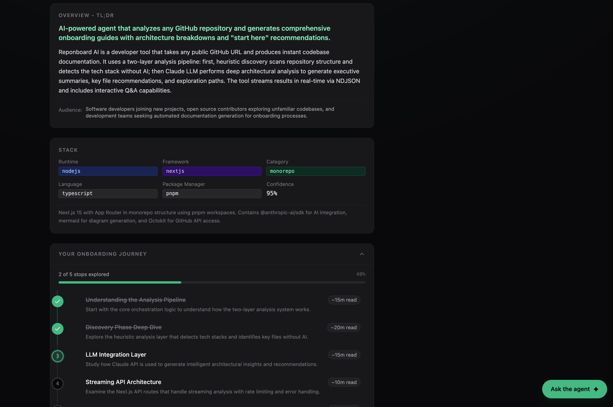
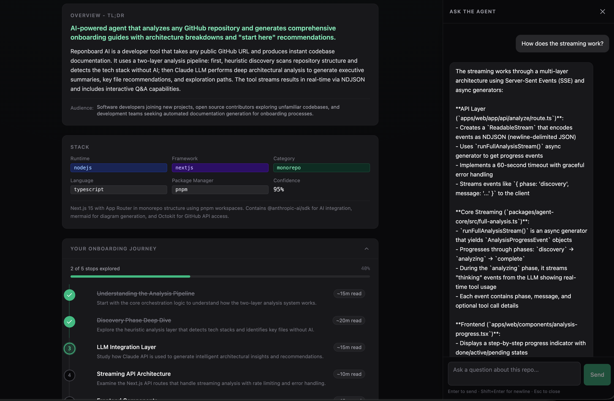

# 🧭 reponboard-ai

> **AI-powered onboarding agent** — Reponboard any codebase in 5 minutes

The codebase tour you never got.

[](https://reponboard-ai.vercel.app)
[](LICENSE)



---

## 🎯 What It Does

An AI agent that analyzes any GitHub repo and turns it into a guided onboarding experience.

Paste a GitHub URL → Get an instant breakdown:

- **Executive Summary** — What this codebase does in 2 paragraphs
- **Architecture Pattern** — Detected pattern (Monolith, Monorepo, MVC, Layered, Event-Driven, Serverless, Jamstack, Library, …) with a rich descriptive subtitle
- **Your Onboarding Journey** — Interactive timeline of stops to follow, with checkmarks, progress bar, time estimates, and clickable file paths
- **Stack & Key Files** — Refined tech stack with reasoning, plus a categorized list of the files that matter and why
- **Interactive Q&A** — Floating chat to ask anything about the analyzed repo

---

## 🚀 Live Demo

**[https://reponboard-ai.vercel.app](https://reponboard-ai.vercel.app)**

> The demo is rate-limited to **5 analyses/day globally** and **3/day per IP** to keep hosting free. If you hit the limit, check back tomorrow or run it locally with your own API key.

---

## ✨ Features

- **Onboarding Journey** — Interactive timeline of stops with progress tracking, time estimates, and clickable GitHub links. Marks where to start, what to read next, and how long each step takes.
- **Architecture Detection** — Identifies the pattern (monolith, monorepo, microservices, MVC, layered, event-driven, serverless, jamstack, library) and pairs it with a rich descriptive subtitle so the label isn't just a slug.
- **Stack Refinement** — Heuristic stack detection (runtime, framework, language, package manager) refined by Claude with reasoning you can read.
- **Key Files Summary** — Categorized file list (entry-point, core-logic, configuration, …) annotated with what each file does and why it matters.
- **Interactive Q&A** — Floating "Ask the agent" drawer (bottom-right FAB). A ReAct agent uses Claude tool_use to fetch files and search code on demand, with file references rendered as clickable GitHub links. Off-topic questions are politely declined — the agent only answers about the analyzed repo.



---

## 🏗️ How It Works

```
GitHub URL
    │
    ▼
┌─────────────────────┐
│  1. DISCOVERY       │  Fetch repo tree, detect stack, find entry points
└─────────────────────┘
    │
    ▼
┌─────────────────────┐
│  2. LLM ANALYSIS    │  ReAct agent (Claude tool_use) explores files
└─────────────────────┘
    │
    ▼
┌─────────────────────┐
│  3. GUIDE OUTPUT    │  Summary, pattern, journey, key files
└─────────────────────┘
    │
    ▼
┌─────────────────────┐
│  4. INTERACTIVE Q&A │  On-demand follow-up questions about the repo
└─────────────────────┘
```

### Tech Stack

| Layer | Tech |
|-------|------|
| Frontend | Next.js 15 (App Router, RSC), TypeScript strict, Tailwind CSS |
| UI primitives | shadcn/ui, lucide-react icons |
| AI Agent | Claude API with tool_use (Haiku for dev, Sonnet for prod) |
| Repo Parsing | GitHub REST API (tree endpoint, no cloning) |
| Streaming | NDJSON over Edge runtime fetch |
| Monorepo | pnpm workspaces |
| Deploy | Vercel (Edge runtime) |

---

## 🏛️ Architecture Highlights

- **Two-layer pipeline** — Layer 1 (`discovery.ts`) does fast heuristic detection without any LLM call (free, deterministic). Layer 2 (`llm-analysis.ts`) calls Claude only on the highest-value files, controlling cost and latency.
- **ReAct agent with tool_use** — Both the analysis pipeline and the Q&A use Claude's tool_use API in a ReAct loop with bounded tool calls. No fragile JSON-string parsing — `finish_analysis` and `respond` are themselves tools, so the structured output is enforced by the model API.
- **NDJSON streaming** — The `/api/analyze` route streams progress events (discovery → fetching → analyzing → complete) so users see perceived progress instead of a 30-second blank screen.
- **Defensive coercion** — When the LLM occasionally omits fields under tool-call/token pressure, missing data falls back to heuristic discovery results rather than failing the whole analysis. Each fallback emits a `[LLM]` warning for observability.
- **Reusable agent-core package** — The agent lives in `packages/agent-core` independent of Next.js, so the same logic can power a CLI, a Slack bot, or any other surface without code duplication.

---

## 💻 Run Locally

```bash
# Clone the repo
git clone https://github.com/aamonterroso/reponboard-ai.git
cd reponboard-ai

# Install dependencies (requires pnpm)
pnpm install

# Set up environment variables
cp .env.example .env.local
# Edit .env.local and add your ANTHROPIC_API_KEY

# Start the dev server
pnpm dev
```

Open [http://localhost:3000](http://localhost:3000) and paste any public GitHub URL.

### Environment Variables

```bash
# .env.local
ANTHROPIC_API_KEY=sk-ant-...   # Required — get one at console.anthropic.com
GITHUB_TOKEN=ghp_...           # Optional — increases GitHub rate limit 60 → 5000/hr
LLM_MODE=development           # development (Haiku, fast) | production (Sonnet, accurate)
```

---

## 📁 Project Structure

```
reponboard-ai/
├── apps/
│   └── web/                       # Next.js application
│       ├── app/
│       │   ├── api/
│       │   │   ├── analyze/       # POST — streaming NDJSON analysis
│       │   │   ├── qa/            # POST — streaming Q&A response
│       │   │   └── remaining/     # GET — daily quota left
│       │   └── page.tsx           # Landing + result view
│       └── components/
│           ├── analysis-result.tsx  # Result page (Journey, Stack, etc.)
│           ├── url-input.tsx        # Input form + stream consumer
│           └── qa-chat.tsx          # Floating Q&A drawer
├── packages/
│   └── agent-core/                # Reusable agent logic
│       └── src/
│           ├── discovery.ts         # Layer 1 — heuristic detection
│           ├── llm-analysis.ts      # Layer 2 — ReAct agent (tool_use)
│           ├── full-analysis.ts     # Orchestrator (generator stream)
│           ├── qa.ts                # Q&A ReAct agent
│           └── types.ts             # Shared types
└── CLAUDE.md                      # Architecture / contribution guide
```

---

## ⚙️ Guardrails

| Guardrail | Details |
|-----------|---------|
| URL validation | Only accepts `github.com/<owner>/<repo>` URLs — no deep paths, no other hosts |
| Rate limiting | 5 analyses/day globally, 3/day per IP (in-memory, resets at midnight UTC) |
| Timeout | 60 s code-level cap on the analysis; Edge streams tokens so progress is visible |
| Cost protection | Max 12 key files sent to LLM, binary/lock files excluded, max 4096 tokens |

### Deployment constraint: Vercel free-tier Edge

The production demo runs on Vercel's free (Hobby) plan, where Edge Functions are hard-killed at ~30 s. Haiku occasionally needs longer than that for large repos, which will appear to the user as a truncated stream. To serve larger repos end-to-end, pick one:

- **Upgrade to Vercel Pro** — raises Edge duration to 300 s.
- **Self-host the API route** — move `apps/web/app/api/analyze` to a long-running runtime (Cloudflare Workers w/ paid plan, Fly.io, Railway, a small VPS) and proxy from Vercel. The code is Edge-compatible so the port is mostly mechanical.

---

## 🛠️ Development Commands

```bash
pnpm dev          # Start dev server (http://localhost:3000)
pnpm build        # Production build
pnpm typecheck    # Type checking
pnpm lint         # Linting
```

---

## 🗺️ Roadmap

Shipping next:

- **Session persistence** — Remember journey progress and analysis result across page refreshes
- **CLI** — `npx reponboard <url>` for terminal-native onboarding
- **Cached analyses** — Vercel KV cache by `owner/repo/sha` to skip redundant LLM calls and share results across users

Exploring:

- **PR/Commit Timeline Analyzer** — "What changed while you were away" narrative with AI-summarized commits and PR activity
- **Slack delivery** — Scheduled Timeline Analyzer reports posted to engineering channels

---

## 📄 License

MIT © [Allan Monterroso](https://github.com/aamonterroso)

---

Powered by [Claude](https://anthropic.com). Built because every dev deserves a proper codebase tour.
